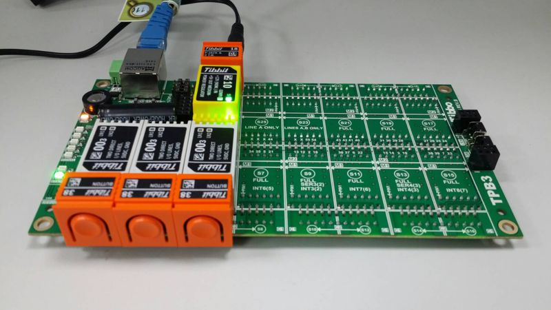
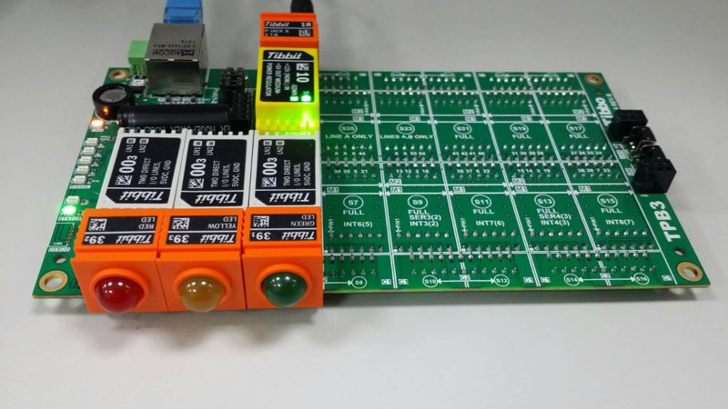

# MQTT Library Demo

To illustrate the use of the MQTT library, we have created two simple Tibbo BASIC applications called "mqtt_publisher" and "mqtt_subscriber".

In our MQTT demo, the publisher device is monitoring three buttons (Tibbits #38). This is done through the keypad (kp.) object.

The three buttons on the publisher device correspond to the red, yellow, and green LEDs (Tibbits #39) on the subscriber device.

As buttons are pushed and released, the publisher device calls mqtt_publish() with topics "LED/Red", "LED/Green", and "LED/Yellow". Each topic's data is either 0 for "button released" or 1 for "button pressed". The related code is in the on_kp() event handler.

The subscriber device subscribes to all three topics with a single call to mqtt_sub() and the line "LED/#". This is done once, inside callback_mqtt_connect_ok().

With every notification message received from the server, the subscriber device gets callback_mqtt_notif() invoked. The LEDs are turned on and off inside this functions' body.

## Testing the MQTT demo

The demo was designed to run on our TPS3 boards, but you can easily modify it for other devices.

The easiest way to get the test hardware is to order ["MQTTPublisher" and "MQTTSubscriber" TPS configurations](http://tibbo.com/store/tps/custom.html).

You can also order all the parts separately:

- On the publisher side:
  - [TPP3 board](http://tibbo.com/store/tps/tpp3.html) in the [TPB3 enclosure](http://tibbo.com/store/tps/tpb3.html).
  - Your will need [Tibbits](http://tibbo.com/store/tps/tibbits.html) #00-3 in sockets S1, S3, S5; and
  - Tibbits #38 in sockets S2, S4, S6;
  - You will also need some form of power, i.e. Tibbit #10 and #18, plus a suitable 12V power adaptor.
- On the subscriber side:
  - [TPP3 board](http://tibbo.com/store/tps/tpp3.html) in the [TPB3 enclosure](http://tibbo.com/store/tps/tpb3.html).
  - Your will need [Tibbits](http://tibbo.com/store/tps/tibbits.html) #00-3 in sockets S1, S3, S5;
  - Tibbit #39-2 (red) in S2;
  - Tibbit #39-3 (yellow) in S4;
  - Tibbit #39-1 (green) in S6;
  - You will also need some form of power, i.e. Tibbit #10 and #18, plus a suitable 12V power adaptor.

  

   

## Test steps

- Install a suitable MQTT server. We suggest HiveMQ (www.hivemq.com):
  - Download the software here: [www.hivemq.com/downloads/](http://www.hivemq.com/downloads/) (you will be asked to register).
  - Unzip the downloaded file.
  - Go to the "windows-service" folder and execute "installService.bat".
  - Go to the "bin" folder and launch "run.bat".
  - You do not need to configure any user names or passwords.
- Open mqtt_publisher and mqtt_subscriber projects in two separate instances of TIDE, then correct the following in the projects' global.tbh files:
  - OWN_IP - assign a suitable unoccupied IP to the publisher and to the subscriber (you know that they will use two different IPs, right?);
  - MQTT_SERVER_HOST - set this to the address of the PC on which your run HiveMQ.
- Select your subscriber and publisher devices as debug targets, and run corresponding demo apps on them.
- Press buttons on the publisher to see the LEDs light up on the subscriber.
- If you are running in [debug mode](http://docs.tibbo.com/taiko/index.html?tide_debugging.htm) you will see a lot of useful debug info printed in the [output panes](http://docs.tibbo.com/taiko/index.html?pane_output.htm) of both TIDE instances.
- You can switch into the release mode to see how fast this works without the debug printing.